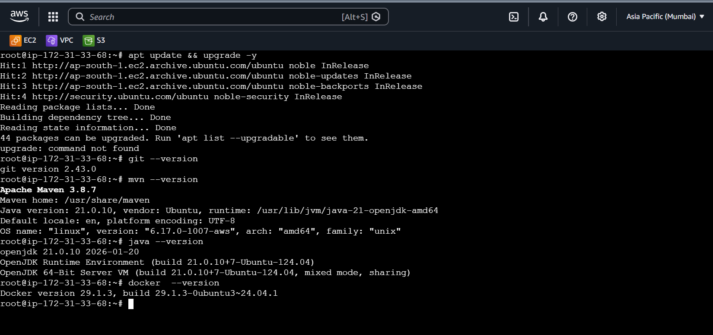

# 🚀 DevOps Environment Setup on Ubuntu Server

## 📌 Project Overview

This project demonstrates the installation and verification of essential DevOps tools on an Ubuntu server.

All required tools are installed and verified successfully in a single environment.

---

## 🛠️ Tools Installed

* 🔹 Git (Version Control)
* 🔹 Java - OpenJDK 17 (Runtime)
* 🔹 Maven (Build Tool)
* 🔹 Docker (Containerization)

---

## ⚙️ Installation Steps

### 1️⃣ Update System

```bash
sudo apt update && sudo apt upgrade -y
```

### 2️⃣ Install Git

```bash
sudo apt install git -y
git --version
```

### 3️⃣ Install Java

```bash
sudo apt install openjdk-17-jdk -y
java -version
```

### 4️⃣ Install Maven

```bash
sudo apt install maven -y
mvn -version
```

### 5️⃣ Install Docker

```bash
sudo apt install docker.io -y
sudo systemctl start docker
sudo systemctl enable docker
```

### 6️⃣ Verify Docker

```bash
docker --version
docker run hello-world
```

---

## 📸 Output Screenshot

Below is the combined verification of all installed tools:



---

## 🔗 GitHub Repository

👉 https://github.com/Anurag842321/skillfied-project-9

---

## 🎯 Result

All DevOps tools have been installed and verified successfully on the Ubuntu server.
The environment is now ready for development, build, and container-based deployments.

---

## 👨‍💻 Author

**Anurag Mishra**
🔗 https://github.com/Anurag842321

